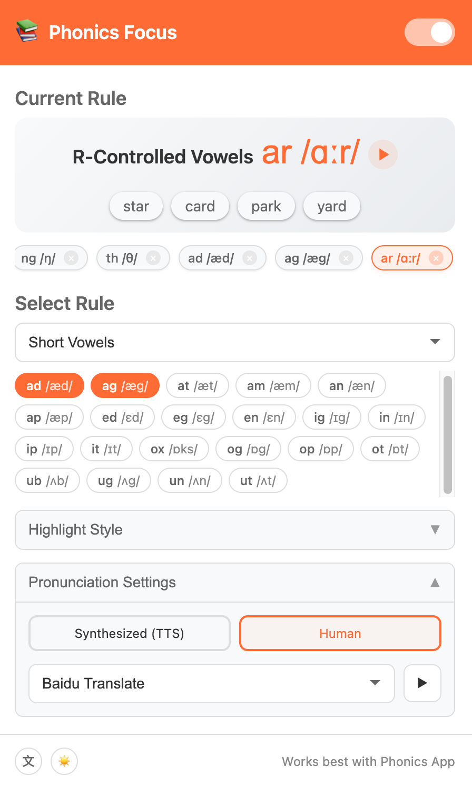
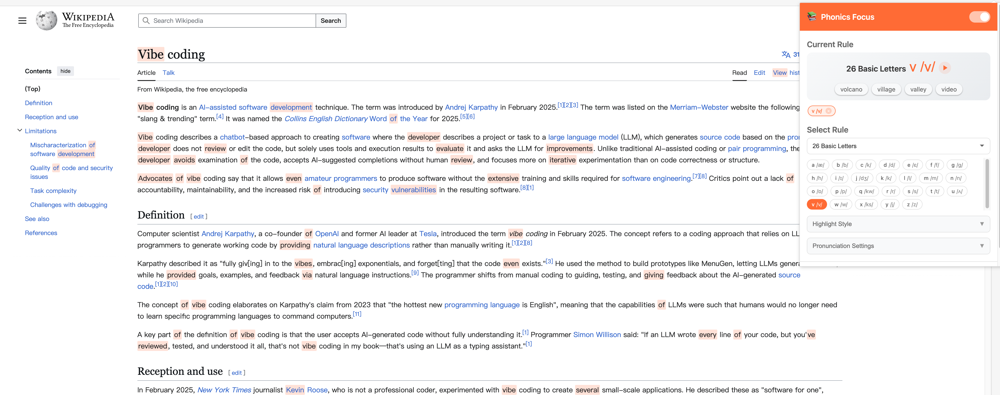

# Phonics Focus

**Phonics Focus** is an immersive phonics companion that helps you learn English pronunciation rules while browsing the web. It automatically highlights words matching specific phonics rules, making learning contextual and effortless.

[中文文档](README_zh.md)

## Features

- 📚 **Comprehensive Phonics Rules**: Covers 26 basic letters, short vowels, long vowels, consonant blends, R-controlled vowels, and other vowel teams.
- 🔦 **Smart Highlighting**: Automatically detects and highlights words on any webpage that match your selected phonics rule.
- 🎨 **Customizable Styles**: Choose from underline, background color, text color, or inline IPA to suit your reading preference.
- 🔊 **Pronunciation Support**:
  - **TTS (Text-to-Speech)**: Adjustable speed and voice selection.
  - **Human Voice**: Sourced from Free Dictionary API, Youdao, Baidu, and Google Translate.
- 🖱️ **Interactive Learning**: Hover over highlighted words to see the rule and IPA, or click to hear the pronunciation.

## Screenshots

> *Please add screenshots here*

| Popup Menu | Webpage Highlighting |
|:---:|:---:|
|  |  |

## Installation

### Method 1: Chrome Web Store (Recommended)

> *Link coming soon*

### Method 2: Manual Installation (Developer Mode)

1.  Download the latest release package: [Download .zip](https://github.com/luw2007/phonics-focus/releases)
2.  Unzip the file to a folder (e.g., `phonics-focus`).
3.  Open Chrome and navigate to `chrome://extensions/`.
4.  Enable **Developer mode** in the top right corner.
5.  Click **Load unpacked**.
6.  Select the unzipped folder (`phonics-focus`).
7.  Done! You should see the Phonics Focus icon in your toolbar.

## Usage

1.  Click the Phonics Focus icon in the browser toolbar.
2.  Select a phonics category and a specific rule you want to focus on.
3.  Refresh the current webpage or browse to a new page.
4.  Words matching the rule will be highlighted.
5.  Hover over a word to see details; click to listen.

## Acknowledgements

- **[Phonics App](https://github.com/cocojojo5213/phonics-app)**: Inspired by this systematic phonics learning application, which sparked the idea of bringing phonics education into everyday web browsing.
- **[CMU Pronouncing Dictionary](http://www.speech.cs.cmu.edu/cgi-bin/cmudict)**: Used for phonetic data and rule matching.

## License

This project is licensed under the [MIT License](LICENSE).
