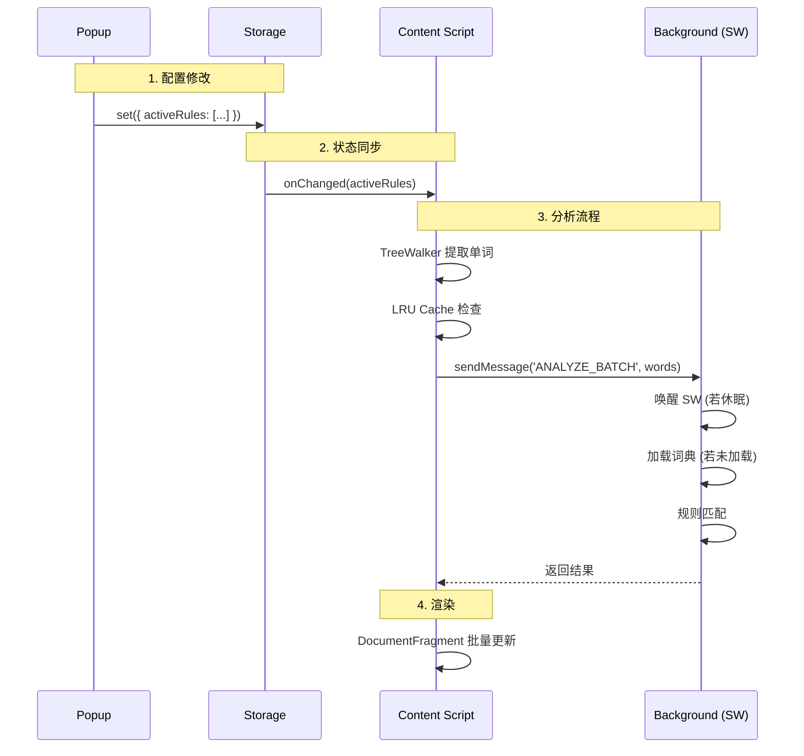

# Phonics Focus - 架构与实现机制 (Architecture & Implementation)

本文档详细记录了 Phonics Focus 扩展的核心架构、数据流向及关键技术实现。

## 1. 整体架构 (Architecture)

项目遵循标准的 **Chrome Extension V3 (MV3)** 架构，由三个主要部分组成：

*   **Manifest (manifest.json)**:
    *   配置中心，声明权限 (`storage`, `activeTab`, `scripting`)。
    *   定义 `background/service-worker.js` 为常驻后台服务。
    *   定义 `content/content.js` 注入到所有 `http/https` 页面。
    *   定义 `popup/popup.html` 为用户交互界面。

*   **Background (Service Worker)**:
    *   **职责**: 核心计算、状态管理、外部 API 调用。
    *   **特点**: 按需启动（Event-driven），负责加载大型词典 (`cmudict.json`)，处理复杂的规则匹配，避免阻塞页面 UI 线程。

*   **Content Script**:
    *   **职责**: DOM 操作、用户交互、渲染高亮。
    *   **特点**: 运行在页面上下文中，通过 IPC (`chrome.runtime.sendMessage`) 与后台通信。

*   **Popup**:
    *   **职责**: 用户配置界面。
    *   **特点**: 通过 `chrome.storage.local` 读写配置，实现状态跨组件同步。

## 2. 核心逻辑 (Core Logic)

### 2.1 智能词典服务 (Dictionary Service)
*   **数据源**: CMUdict (Carnegie Mellon University Pronouncing Dictionary)，已转换为 JSON 格式 (`data/cmudict.json`, ~4MB)。
*   **加载机制**:
    *   **单例模式**: `DictionaryService` 在 Service Worker 中作为单例存在。
    *   **Lazy Load**: 仅在首次需要查词或分析时通过 `fetch` 加载，避免无谓的内存占用。
    *   **内存驻留**: 一旦加载，数据驻留在 Service Worker 内存中，直到 Worker 被终止。

### 2.2 规则匹配引擎 (Rule Engine)
*   **规则定义**: `data/phonicsData.js` 包含 6 大类、70+ 种发音规则。
*   **匹配算法**:
    1.  **预计算索引 (Inverted Index)**: 启动时构建 `word -> rules[]` 映射，实现 O(1) 快速查找已知示例词。
    2.  **IPA 模式匹配**: 对于未知单词，查询 CMUdict 获取 IPA，检查是否包含特定音素组合（如 `/æ/` 匹配 Short A）。
    3.  **多规则支持**: 支持同时激活多个规则，通过 `matchMultiple` 方法按优先级匹配。

### 2.3 数据持久化
*   **存储引擎**: `chrome.storage.local`。
*   **同步机制**: Content Script 监听 `onChanged` 事件，实现配置修改后的即时重绘 (Hot Reload)。

## 3. 性能优化 (Performance Optimization)

为了在复杂网页（如 Wikipedia）上保持流畅体验，实施了多层优化：

### 3.1 Service Worker 层
*   **请求批处理**: 使用 `ANALYZE_BATCH` 消息一次性发送页面所有单词，大幅减少 IPC 通信开销。
*   **冷启动优化**: 
    *   **HTTP Cache**: 利用浏览器缓存加速 `cmudict.json` 加载。
    *   **Keep-Alive 心跳**: Content Script 每 20 秒发送 `PING` 消息，防止 Service Worker 在用户活跃浏览时进入休眠，确保词典常驻内存。

### 3.2 Content Script 层
*   **LRU 缓存**:
    *   内部维护容量为 1000 的 `LRUCache`。
    *   高频单词（the, and, is）直接命中缓存，无需 IPC 请求。
*   **DocumentFragment**:
    *   批量构建 DOM 节点，将 N 次 DOM 插入合并为 1 次，减少重排 (Reflow)。
*   **任务分片 (Time Slicing)**:
    *   利用 `IntersectionObserver` 仅处理视口内元素。
    *   使用 `setTimeout` 分散高亮任务，避免主线程阻塞导致的掉帧。

### 3.3 DOM 遍历
*   **TreeWalker**: 仅遍历文本节点 (`NodeFilter.SHOW_TEXT`)，自动忽略 `SCRIPT`, `STYLE` 等标签，提高遍历效率。

## 4. 通信流程 (Data Flow)

