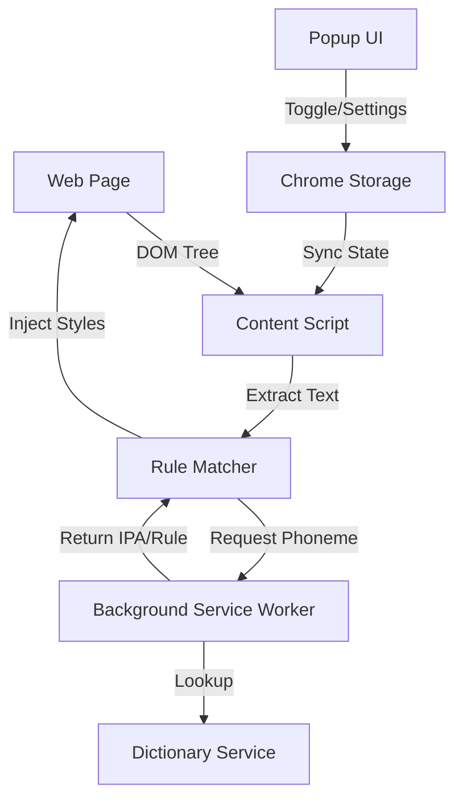

# Phonics Focus - 沉浸式自然拼读伴侣

## 1. 项目概述 (Project Overview)
**Phonics Focus** 是一款 Chrome 浏览器扩展 (Extension)，旨在作为 `phonics-app` 的伴侣工具。它利用用户的日常网页浏览时间，通过智能高亮和发音辅助，实现自然拼读规则的“沉浸式习得”与“高频复习”。

## 2. 核心价值 (Value Proposition)
*   **打破学习边界**：将 Phonics 学习从专门的 App 延伸到所有英文网页，实现“学以致用”。
*   **高频视觉强化**：在真实语境中反复展示当前学习的元音规则，建立牢固的形音连接。
*   **资产复用**：复用 `phonics-app` 成熟的词典服务与发音规则库，降低开发成本。

## 3. 用户故事 (User Stories)
*   **US-001 [进度同步]**：作为用户，我希望插件能自动知道我在 App 里学到了哪个 Level（例如 "Short A"），无需手动配置，以便无缝开始复习。
*   **US-002 [视觉强化]**：作为用户，当我在浏览任意网页时，我希望符合当前规则的单词（如 "cat", "map"）能被高亮显示，提醒我注意发音。
*   **US-003 [发音验证]**：作为用户，当我遇到不确定的高亮单词时，我希望鼠标悬停能看到 IPA 音标并听到发音，以验证我的拼读。
*   **US-004 [无干扰模式]**：作为用户，当我需要专注阅读或进行严肃工作时，我希望能在工具栏一键关闭高亮，避免干扰。

## 4. 功能列表 (Feature List)

| ID | 模块 | 功能名称 | 优先级 | 详细说明 |
| :--- | :--- | :--- | :--- | :--- |
| **F-01** | **核心交互** | **规则智能高亮** | **P0** | 扫描可视区域文本，基于词典匹配当前规则单词，注入 `<mark>` 样式。 |
| **F-02** | **核心交互** | **全局开关** | **P0** | Popup 面板提供大按钮，控制插件的开启/暂停状态。 |
| **F-03** | **辅助功能** | **悬浮音标 (Tooltip)** | **P1** | 鼠标悬停高亮词时，显示 IPA 音标及发音按钮。 |
| **F-04** | **数据同步** | **学习进度同步** | **P1** | 读取 `phonics-app` 存储的进度，或提供 API 接口进行同步。 |
| **F-05** | **个性化** | **规则手动选择器** | **P2** | 允许用户强制指定复习某个规则（如“今天只想看 Long E”）。 |
| **F-06** | **设置** | **高亮样式自定义** | **P3** | 提供几种高亮风格（下划线、背景色、文字色）以适应不同网页背景。 |

## 5. 技术方案 (Technical Architecture)

### 5.1 架构概览
采用 **Chrome Extension Manifest V3** 标准。

### 5.2 关键模块
*   **Background Service Worker**: 
    *   承载核心词典 (`cmu-pronouncing-dictionary`)。
    *   由于词典较大 (~2MB+)，需常驻内存或使用 IndexedDB 缓存，避免每次页面加载都初始化。
    *   提供 `analyzeWord(word)` 消息接口，返回音标及命中的规则。
*   **Content Script**:
    *   使用 `TreeWalker` 高效遍历 DOM 文本节点。
    *   使用 `IntersectionObserver` 仅处理可视区域，优化性能。
    *   Shadow DOM 或特异性 CSS (`span.phonics-highlight`) 避免样式污染。
*   **Dictionary Service**:
    *   移植 `server/services/dictionary.js`。
    *   移除 Node.js `fs` 依赖，改用 `fetch` 加载 JSON 资源。

### 5.3 数据流
1.  **初始化**：插件加载时，Background Worker 初始化词典数据。
2.  **页面加载**：Content Script 读取 Storage 中的“开关状态”和“当前规则”。
3.  **分析**：Content Script 提取文本 -> 发送消息给 Background -> Background 查词典 -> 返回匹配结果。
4.  **渲染**：Content Script 将匹配词包裹 `` 并应用样式。

## 6. 交互原型 (UI Sketch)

### 6.1 网页高亮效果
> The quick brown **f[o]x** jumps over the lazy d[o]g.
> *(注：[o] 表示高亮样式，如橙色下划线)*

### 6.2 Popup 面板
*   **顶部**：Logo + 开关 (Toggle Switch)
*   **中部**：当前规则卡片 (e.g., "Short O")
    *   显示示例词：hop, pot, fox
    *   "Change Rule" 按钮 (进入选择器)
*   **底部**：设置入口

### 6.3 Tooltip
*   悬停在 "fox" 上：
    *   **fox**  /fɒks/ 🔊
    *   Rule: Short O
